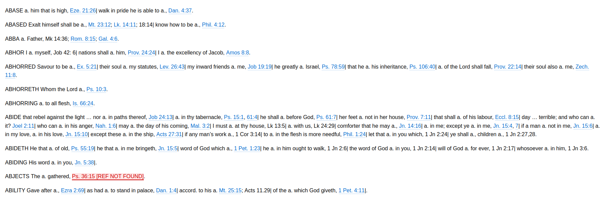

# Concordance Proof Reading Application

This application is used to convert a manaully proofread and edited concordance, that was originally OCR'ed from a
printed concordance, into a html page which is easy to double check. The input is in the ODT file format.

The key features are:
1. All bible verse references are hyperlinks to Bible Gateway verses
2. Also, on hover over the reference, the full verse appears at the tool tip
3. References to non-existant verses appear as as "[REF NOT FOUND]" to make it easy to identify

The hover verses are taken from https://github.com/farskipper/kjv which has the whole KJV bible in a JSON format.

## HTML View

This is how the html output looks like:


## Deployment

Once downloaded to the server, run pip install, then:
```
python3 -m spacy download en_core_web_sm
```

This application is meant to be deployed via cPanel Python App feature. See [DEPLOY.md](DEPLOY.md)
for details.

## Dev

Run the web application locally with:

```
python3 app.py
```

### CI

All code must pass the CI checks.

You must autoformat your code with:

```sh
black .
isort .
```

Then verify that all Pylint passes with no warnings/errors:

```sh
pylint $(git ls-files '*.py')
```

Run all unittests with:

```sh
pytest --cov=.
```
